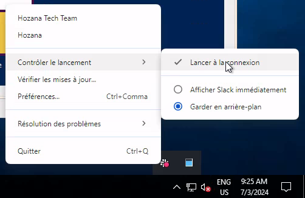

# Slack When Ready

Before installing, disable Slack automated startup using the tray bar menu:

Then quit Slack using the same menu.

## Windows :

Make sure your Slack version comes from the Slack download page. This will not work if Slack was installed from the Microsoft Store. To check :   
- Open Settings → Apps → Installed Apps.
- If Slack is listed with the label "Microsoft Store", it was installed from the Store (not good)
- Otherwise, it is the version from the Slack website (perfect)

Download slack-when-ready.exe from the latest release in the "Releases" section at the right of this page.

Run slack-when-ready.exe instead of the official Slack client (which is still used, but with additionnal code injected into it). 

To make slack-when-ready.exe run automatically when the system starts :

- Press Win + R to open the Run dialog.
- Type shell:startup and press Enter. This will open the Startup folder.
- Place a shortcut to slack-when-ready.exe in this folder.

## Linux / OS X :

Clone this repository and run ./slack-when-ready in the root directory.
